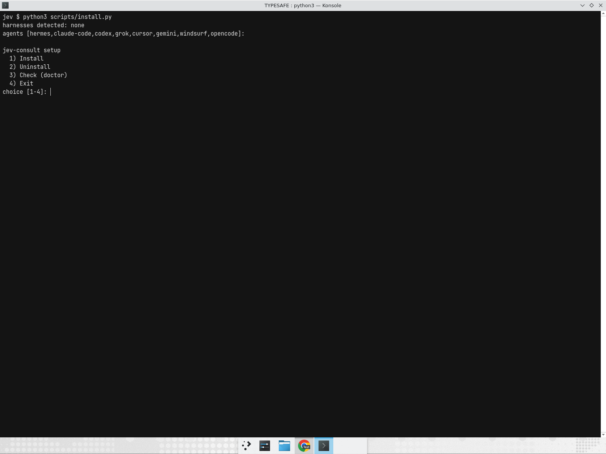
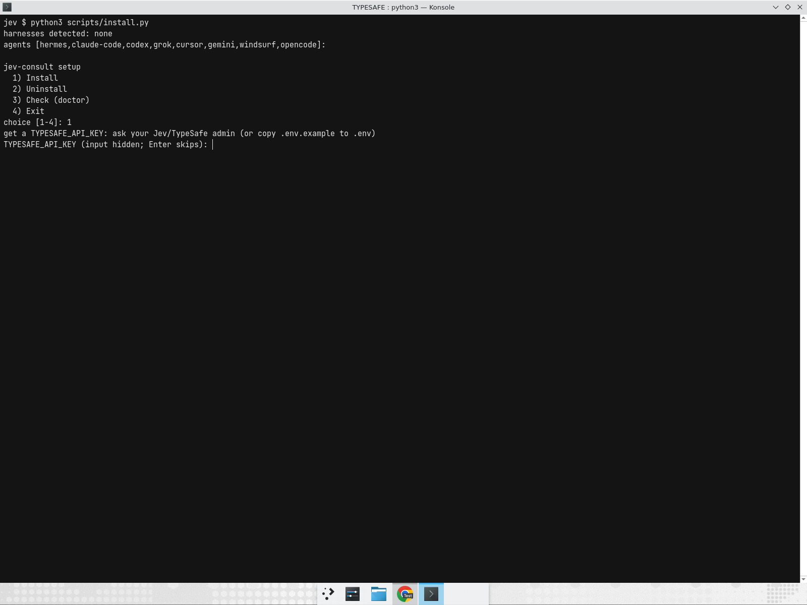
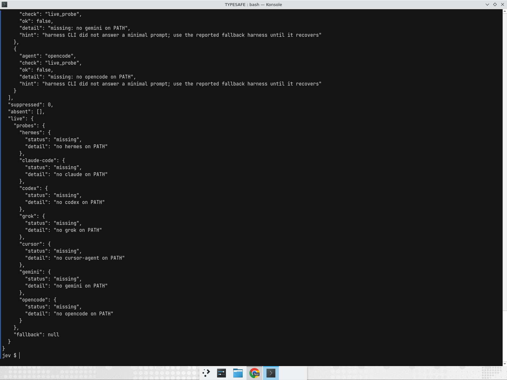
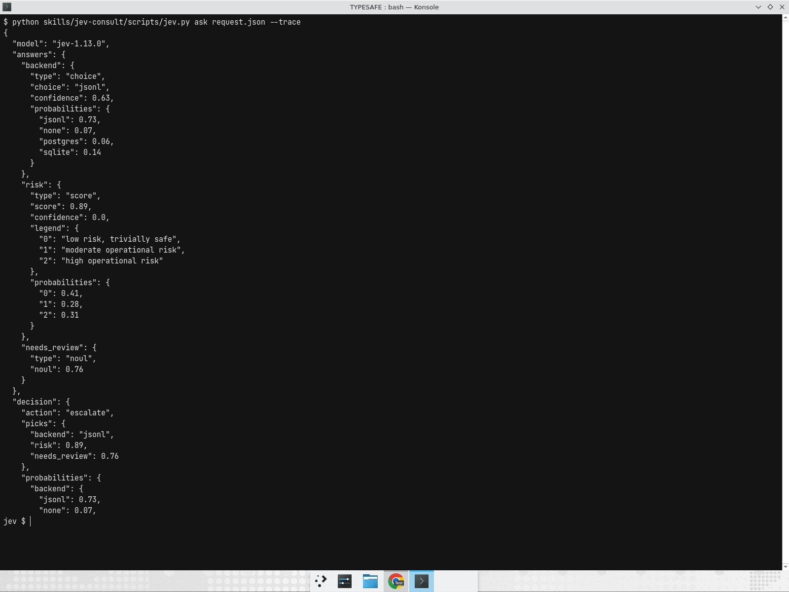
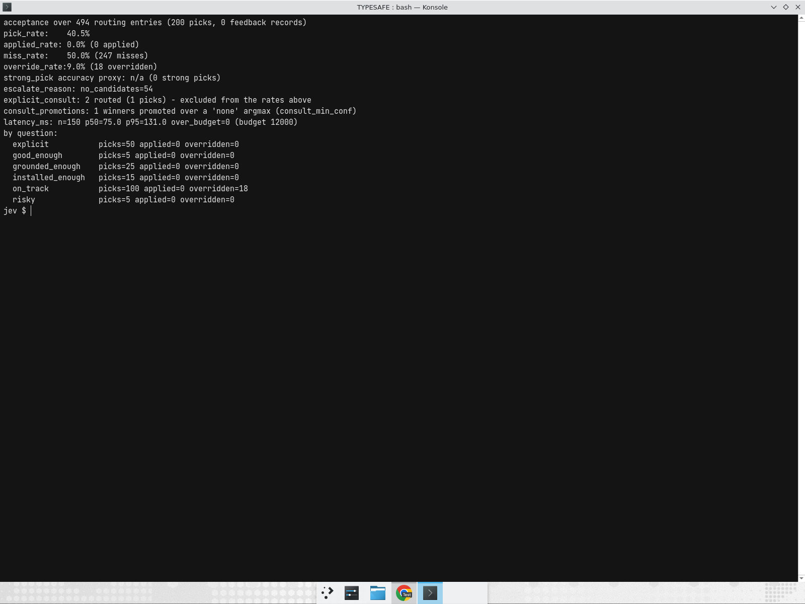
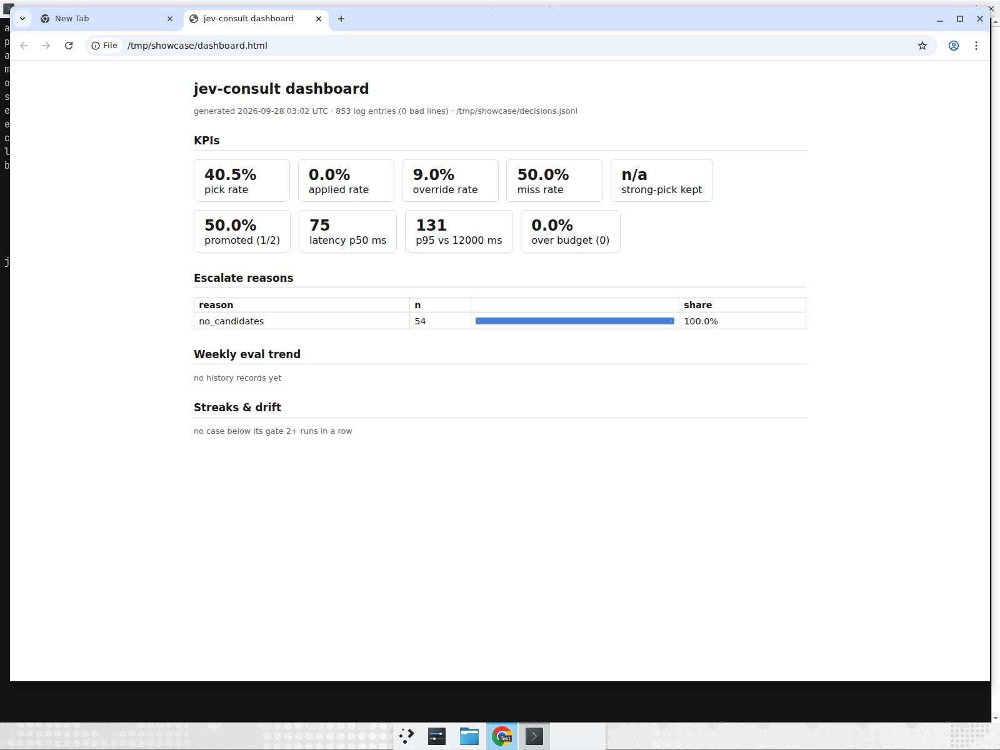

# jev-consult

[](https://github.com/Frtertaer/TYPESAFE/actions/workflows/tests.yml)
[](https://github.com/Frtertaer/TYPESAFE/actions/workflows/live-eval.yml)
[](LICENSE)


Режим: ты даёшь только задачу/план. ИИ-кодер сам смотрит проект. **Jev принимает решения** (TypeSafe System One): подход, keep vs change, библиотека, архитектура, good-enough. Jev не пишет «сделай вот это» текстом — только Choice / Noul / Score. Кодер переводит ответ в действие или эскалирует тебе. Промпт-хук IDF-шортлистит уже установленные skills/plugins/MCP и пишет каждое решение в `decisions.jsonl`; `progress.py` ведёт opt-in леджер ревью вклада.

После clone **одна команда** подключает режим в **Hermes**, **Claude Code (desktop)**, **Codex**, **Grok Build**, **Cursor**, **Gemini**, **Windsurf**, **opencode** (список — `ALLOWED` в `scripts/install.py`):

```text
python scripts/install.py
```

Windows: `install.cmd`. Unix: `sh install.sh`. Обёртки сами находят Python (`py -3` → `python` → `python3`; если нет — подсказывают https://www.python.org/downloads/ с галочкой «Add python.exe to PATH») и в интерактивном терминале открывают меню `--setup` (без TTY — обычная установка, как раньше). `py` без установленного Python 3 не считается находкой — обёртка проваливается к следующему кандидату.

Ключ `TYPESAFE_API_KEY` человек кладёт сам (`.env.example` → локальный `.env` или env харнесса; меню `--setup` спрашивает его скрыто через getpass и пишет в `.env` харнесса). В git ключа нет. Инсталлятор пишет `TYPESAFE_API_KEY: set` или `missing`, значение не печатает.

Открыл этот репозиторий как проект — копировать ничего не нужно: `AGENTS.md`, `CLAUDE.md` и `.hermes.md` уже в git.

## Быстрый старт

Windows — один файл, Python не нужен вообще — путь для нетехнического пользователя. Скачайте `jev-setup-windows-amd64.exe` и запустите двойным кликом:

```text
https://github.com/Frtertaer/TYPESAFE/releases/latest/download/jev-setup-windows-amd64.exe
```

Linux/macOS, или Windows с уже установленным Python — `jev-setup.pyz` (zipapp, тоже один файл):

```text
curl -fsSL -o jev-setup.pyz https://github.com/Frtertaer/TYPESAFE/releases/latest/download/jev-setup.pyz
python jev-setup.pyz
```

Запасной вариант на Windows без exe (pyz + обёртка): скачайте в одну папку оба файла и запустите `jev-setup.cmd` — двойным кликом или из консоли. Обёртка сама находит Python (`py -3`, затем `python`) и запускает лежащий рядом `jev-setup.pyz`:

```text
https://github.com/Frtertaer/TYPESAFE/releases/latest/download/jev-setup.pyz
https://github.com/Frtertaer/TYPESAFE/releases/latest/download/jev-setup.cmd
```

Exe, pyz и cmd несут одинаковый payload: скилл, `install.py` и `doctor.py` — git clone не нужен. Откроется меню: **1) Install 2) Uninstall 3) Check (doctor) 4) Exit**. Меню находит уже стоящие харнессы, спрашивает ключ скрыто (getpass) и пишет его в `.env` харнесса, бандла и `~/.env` (chmod 600; на Windows — ACL владельца через `icacls`), в конце прогоняет doctor и печатает сводку вида `PASS (2 harnesses ok, 2 not installed)` — отсутствующий харнесс — не ошибка. Payload лежит в `~/.jev-consult/bundle/`; exe дополнительно остаётся в `~/.jev-consult/jev-runtime.exe`, так что хуки работают без Python.

Путь разработчика — clone:

```text
git clone <repo-url> && cd TYPESAFE
python scripts/install.py                 # ставит скилл в 8 харнессов (голый запуск в TTY открывает меню)
# TYPESAFE_API_KEY=... в .env или env харнесса (значение не печатать)
python skills/jev-consult/scripts/doctor.py        # rc 0 = установка ок
python -m unittest discover -s tests      # прогон всей suite
make test-jev                             # один test-файл по суффиксу (или python -m unittest tests.test_jev)
```

Собрать артефакты из clone: `python scripts/package_release.py` или `make package` (zipapp в `dist/` + `jev-setup.cmd` рядом). `python scripts/package_release.py --exe` дополнительно собирает exe: на Windows-хосте с PyInstaller — готовый `dist/jev-setup-windows-amd64.exe`, иначе — дерево `dist/exe/` для достройки `build-exe.cmd`. PyInstaller не кросс-компилирует — exe собирает CI-джоба `release-exe.yml` на `windows-latest`, которая пересобирает `nightly`-релиз на каждый push в master.

## Как это выглядит

Меню установки (TTY) — обнаружение харнессов, выбор действия, скрытый ввод ключа:




`doctor.py --live` — проверка установки по харнессам с пробником CLI (available/limited/missing):



`jev.py ask request.json --trace` — один вызов Jev: Choice + Score + Noul, на этом запросе решение — `escalate` по `low_score_confidence`:



`decisions.py --acceptance` — прод-метрики по накопленному `decisions.jsonl` (pick/applied/override/miss, `route: explicit_consult` отдельно, `consult_promotions` отдельно):



`dashboard.py` — один self-contained `dashboard.html` из лога и eval-history (KPI, escalate_reasons, weekly-тренд, streak/drift); также складывается артефактом в `live-eval.yml`:



## Что в репозитории

| Путь | Зачем |
| --- | --- |
| `AGENTS.md` / `CLAUDE.md` / `.hermes.md` | Инструкции агенту из коробки |
| `skills/jev-consult/SKILL.md` | Скилл |
| `skills/jev-consult/policy.json` | Единственный файл порогов и шаблонов |
| `skills/jev-consult/scripts/jev.py` | CLI без зависимостей: `ask` / `scaffold` / `decide` / `lint` / `ping` / `env` (`ask --trace` подмешивает план; `env` печатает resolved-конфиг без значения ключа); `--schema` печатает контракт request/response |
| `skills/jev-consult/scripts/question_lint.py` | Статический линт формулировок вопросов J001–J021 (вызывается из `jev lint`); `--schema` печатает контракт ключей request.json |
| `skills/jev-consult/scripts/inventory.py` | Скан установленных skills/plugins/MCP, шортлист; `--schema` печатает контракт ключей payload/item; `--env` печатает resolved-конфиг (task/limit/log/watch/policy) |
| `skills/jev-consult/scripts/inventory_hook.py` | IDF-шортлист, затем один Jev-пикер (fail-open, ничего не ставит; `--schema` — контракт emit-пayload) |
| `skills/jev-consult/scripts/peer_fill.py` | Пустой шортлист: Jev выбирает скилл уже на машине, скрипт копирует в текущий харнесс; `--schema` печатает контракт fill-записи, `--env` — резолвнутый конфиг |
| `skills/jev-consult/scripts/catalog_fill.py` | Если локально пусто: поиск Hermes find-skill, Jev выбирает один, inspect, `hermes skills install --yes`; `--schema` печатает контракт fill-записи, `--env` — резолвнутый конфиг |
| `skills/jev-consult/scripts/apply_fill.py` | Если и каталог скиллов пуст: один Hermes-плагин (`--no-enable`) или один официальный MCP. Не npx, не `claude plugin install`; `--schema` печатает контракт fill-записи, `--env` — резолвнутый конфиг |
| `skills/jev-consult/scripts/trace.py` | Файл-память `.jev-trace.json` (план/шаг/попытки); `env` подкоманда печатает резолвнутый конфиг |
| `skills/jev-consult/scripts/compare.py` | Сравнение до/после на липких промптах (`--live`); `--env` печатает резолвнутый конфиг |
| `skills/jev-consult/scripts/compact.py` | Дефолт — LIVE_FAT (жирный текущий tool result); вырезанная середина сохраняется в spill. Session-drop Tamara только с `--history` (Hermes eval не принял); `--schema` печатает контракт ключей результата/spill; лимиты spill-каталога (`spill_max_files`/`spill_max_bytes`) живут в policy.json, флаги `--spill-max-*` перекрывают; `--env` печатает резолвнутый конфиг |
| `skills/jev-consult/scripts/compact_hook.py` | PostToolUse-хук: урезает жирный `tool_result` (>LIVE_FAT, не ошибка), полный вывод в spill; всегда `{}` fail-open |
| `skills/jev-consult/scripts/decisions.py` | Чтение `decisions.jsonl`: статистика, фильтры (`--status/--harness/--since/--grep/...`), `--harness-health` (доля timeout/error по харнессу за час — сигнал по квотам), `--watch`, `--jq`, `--schema` печатает контракт ключей записи, `--env` — резолвнутый конфиг (file/source/exists/count/env) |
| `skills/jev-consult/scripts/dashboard.py` | Один self-contained `dashboard.html` из `decisions.jsonl` + `eval-history.jsonl` (+ `eval-live.json`): KPI-карты, weekly-тренд, streak/drift; чистый ASCII-вывод, `--watch` с bounded ticks, `--schema`/`--env`/`--verdict` |
| `skills/jev-consult/scripts/drift_calibrate.py` | Drift-стрик ≥ `streak_fail_weeks` → план `calibration` PR (`plan.json`/`pr-body.md`/патченый `policy.json`/diff в `--out-dir`); fail-open при тонком логе (`comment`), `dedupe` по открытому PR; git/policy не трогает |
| `skills/jev-consult/scripts/doctor.py` | Read-only проверка установки по харнессам (skill/hooks/log/ключ) и леджера `.devin/progress.sqlite3` в текущем репо (`--only progress_ledger`); rc 0 = всё ok; `--live` — opt-in пробник CLI каждого харнесса (available/limited/missing/error + `live.fallback`, `--live-timeout S`); `--offline` пропускает харнесс-чеки (presence → skipped) и печатает `local_*` чеки для того, что работает без харнесса (lint/trace/decisions/compact/progress); `--schema` печатает контракт payload и каталог имён чеков |
| `scripts/vendor_check.py` | Сверяет `vendor/PORTS.json` с `UPSTREAM_COMMIT` пинами и печатает diff-статы вендор↔наш порт; `--fetch` сравнивает upstream HEAD с пином (rc 1 когда upstream ушёл вперёд); `--diff` показывает полные diff; `--json` для машины |
| `skills/jev-consult/scripts/policy_lint.py` | Валидация `policy.json` (`--strict`, `--fix` чистит лишние ключи, `--diff OTHER`) |
| `skills/jev-consult/scripts/skill_lint.py` | Sanity SKILL.md-фронтматтера и ссылок на scripts/*.py S001–S009 (`--fix` правит name→dir, `--strict`) |
| `skills/jev-consult/scripts/trigger_lint.py` | Линт триггер-кейсов T001–T011 (`--fix` чинит id-ы и дедуп) |
| `skills/jev-consult/scripts/trigger_eval.py` | Офлайн-оценка покрытия триггеров (`--coverage`, `--uncovered`, `--fail`) |
| `skills/jev-consult/scripts/smoke.py` | Офлайн e2e-прогон без API (`--only`, `--list`, `--junit`, `--verdict`, `--watch`; `--env` печатает resolved config JSON: steps/only/repeat/jobs/timeout/watch_*/policy; `--jq KEY`/`--out PATH`) |
| `skills/jev-consult/scripts/progress.py` | Леджер вклада по этапам: `init` / `lint` / `status` / `history` / `evidence` / `assess` / `invalidate` / `restore` / `review` / `report` (`--all` — сводка по всем этапам с суммами по категориям рубрики и по репозиториям) / `calibrate` (золотые кейсы `examples/progress-cases.json`; `--live` зовёт реальную модель) / `self-test`; очки только за проверенный чеками diff; `env` подкоманда печатает резолвнутый конфиг |
| `skills/jev-consult/scripts/_watch.py` | Общий импорт-хелпер watch-режимов (`dig`/`emit_or_jq`/`cap`/`deadline`/`write_verdict`), без CLI-команд |
| `skills/jev-consult/scripts/progress_core.py` | Движок леджера для `progress.py` и `policy_lint.py` (SQLite + GitEvidence); импортируется, отдельных команд нет |
| `~/.cache/jev-consult/decisions.jsonl` | Журнал решений хука, по строке на промпт (`JEV_CONSULT_LOG=0` выключает, `JEV_CONSULT_LOG=PATH` переадресует) |
| `~/.cache/jev-consult/spill/` | Полные выводы, вырезанные compact (`<sha>.txt`, owner-only каталог, максимум 200 файлов / 256 МБ; `JEV_CONSULT_SPILL=0` выключает, `JEV_CONSULT_SPILL=PATH` переадресует) |
| `scripts/install.py` | Копия скилла в 8 харнессов из `ALLOWED` (`--env` печатает resolved config JSON: agents/home/hermes_home/source/targets/existing/policy/key_set; `--jq KEY`/`--out PATH`); `--source DIR` — установка из распакованного бандла, `--setup` — интерактивное меню, `--live` — после install/check гонит doctor `--live` и помечает rate-limited харнессы с fallback-подсказкой |
| `scripts/package_release.py` | Сборка `dist/jev-setup.pyz` — однофайлового zipapp-инсталлятора (скилл + инсталлятор + doctor) и `dist/jev-setup.cmd` для Windows; `--exe` — PyInstaller-дерево/exe `jev-setup-windows-amd64.exe` в `dist/`; работает без git clone |
| `scripts/exe_entry.py` | Entry point exe: распаковывает payload из `_MEIPASS` в `~/.jev-consult/bundle`, запускает install.py `--source`; `<exe> script.py` — replay скриптов для хуков без Python |
| `install.cmd` / `install.sh` | Обёртки: bootstrap Python (`py -3` → `python3` → `python`, иначе подсказка python.org), затем `install.py --setup` в интерактивном терминале (без TTY — `install.py` как раньше) |
| `tests/test_jev.py` / `test_inventory.py` / `test_inventory_hook.py` / `test_peer_fill.py` / `test_catalog_fill.py` / `test_apply_fill.py` / `test_trace.py` / `test_compare.py` / `test_compact.py` / `test_compact_hook.py` / `test_skill_evals.py` | Юнит-тесты без живого API |
| `vendor/fast-jev-compaction` | MIT-снимок upstream; рантайм — `compact.py`, не плагин Claude |
| `vendor/awesome-jev` | Снимок каталога (inspect-only) |
| `vendor/typesafeai-cli` | MIT Python CLI; наш клиент остаётся `jev.py` |
| `vendor/awesome-llm-apps-skill-evals` | Apache-2.0 снимок evals-инструментов (inspect-only); рантайм — `skills/jev-consult/scripts/skill_scanner.py` |
| `vendor/jev-skill-suggester` | MIT-снимок upstream (inspect-only); перенесены защиты в `jev.py`/`inventory.py`, их CLI не запускаем |
| `vendor/jevcal` | MIT-снимок upstream (inspect-only); правила линта перенесены в `question_lint.py` |
| `vendor/skill-router` | MIT-снимок upstream (inspect-only); перенесены `strong_pick` и журнал решений |
| `vendor/omp-jev-compaction` | MIT-снимок upstream (inspect-only, TS); перенесён spill в `compact.py` |

Jev не помнит прошлые вызовы. В `state` — факты, план, шаг, счётчик попыток, шортлист. Если кодер не помнит план — читает `.jev-trace.json` и зовёт `ask --trace`. Не спрашивать то, что проверяется инструментом.

Jev **не** убивает галлюцинации «по максимуму» и не факт-чекер. Он режет выдуманные *решения*: кодер не выбирает курс сам. Срыв плана / тупик / «не знаю» / «не помню» / зависание в ответе → `ask` с `on_track` / `next_move` / `stuck_move` / `unknown_move`. Пользователь инструменты не выбирает: хук сам подставляет уже установленные skills/plugins/MCP по тексту промпта (Claude `UserPromptSubmit`, Hermes `pre_llm_call`, Codex `UserPromptSubmit` в `~/.codex/hooks.json` — пока не trusted в `/hooks`, хук не бежит, Cursor `beforeSubmitPrompt` в `~/.cursor/hooks.json`, Gemini `BeforeAgent` в `~/.gemini/settings.json`). Grok пишет `.jev-tools.json`. Если sidecar есть, грузить его, иначе fallback:

```text
python skills/jev-consult/scripts/inventory.py --task "<task>" --harness auto --write-ask tools.request.json
python skills/jev-consult/scripts/jev.py ask tools.request.json
```

Хук: IDF-шортлист уже установленных, затем **один** вызов Jev (`load_tools` + `need_skill`, 8с, fail-open). Если пользователь сам назвал скилл (`$имя` или точное имя из нескольких слов через дефис), хук берёт его без вызова Jev; Codex-скиллы с `allow_implicit_invocation: false` попадают в шортлист только когда названы явно. Strong pick: p ≥ `strong_pick` (0.85 в `policy.json`) выигрывает с пометкой `strong`; остальные разрешимые пики тоже выигрывают — need-путь снят: маршрутизация = `strong_pick` + `confidence_floor`, `need_skill` пишется только как телеметрия. Все пороги только в `policy.json`. Каждое решение хука дописывается строкой в `~/.cache/jev-consult/decisions.jsonl` (`JEV_CONSULT_LOG=0` выключает; ключ в лог не пишется). Ничего не ставит. Пустой шортлист: агент гоняет `peer_fill.py --from-miss`; если `no_peer` — `catalog_fill.py --from-miss` (один скилл); если `no_catalog` — `apply_fill.py --from-miss` (один Hermes-плагин `--no-enable` или один официальный MCP). npx и `claude plugin install` не ставятся. `--force` нет. Сторожевого процесса нет. Сжатие по умолчанию — только LIVE_FAT текущего жирного результата, не Tamara session-drop. Вырезанная середина сохраняется целиком в `~/.cache/jev-consult/spill/<sha>.txt` — маркер называет файл; каталог owner-only (chmod 700), максимум 200 файлов / 256 МБ, `JEV_CONSULT_SPILL=0` выключает.

Сравнение на одном тестовом запросе (без Jev vs с трассой и Jev):

```text
python skills/jev-consult/scripts/compare.py
python skills/jev-consult/scripts/compare.py --live
```

Политика: высокий confidence / однозначный Choice → делать. Noul `0.5` = «да и нет одинаково», не «средне». На необратимом шаге при низкой уверенности — спросить человека. «Лучший вариант» = max probability.

## Локали consult-байпаса

`explicit_consult_tokens` в `policy.json` — объект `{lang: [фразы]}`; сейчас en/ru/de/es/fr. Матч идёт по целой фразе: регистр и повторные пробелы нормализуются, границы — не-словесные символы. Это не поиск подстроки и не по одному слову.

Как добавить язык: новый ключ с кодом локали и списком многословных фраз, которыми носитель реально просит совет («should I / advise me» — «soll ich», «qué me recomiendas», «est-ce que je devrais»). Однословные фразы не добавлять — они дают ложные срабатывания; регистр и акценты нормализация не стирает, поэтому варианты без акцентов («que me recomiendas») перечисляются отдельно. Форму проверяет `python skills/jev-consult/scripts/policy_lint.py --strict` (P003: объект `{lang: [непустые строки]}`).

Правило: каждая новая локаль обязана получить негативный тест на ложное срабатывание. В `tests/test_explicit_consult.py` (`test_false_positive_negatives`) добавляются близкие фразы локали, которые НЕ должны матчиться: другой порядок слов, другое спряжение, знак препинания, разрывающий фразу.

## После установки

```text
python tests/test_jev.py
python skills/jev-consult/scripts/jev.py ping
```

Куда копируется скилл: `skills/jev-consult/references/harnesses.md`.

После правки `policy.json` снова `python scripts/install.py`.

Снять:

```text
python scripts/install.py --uninstall
```

Опции: `--agents hermes,codex` ставит только в часть харнессов; `--dry-run` показывает план без записи; `--check-key` печатает `TYPESAFE_API_KEY: set|missing` (значение — никогда); `--setup` — интерактивное меню Install/Uninstall/Check/Exit (стартует и при голом запуске в TTY; без TTY выходит с rc 2 и подсказкой); `--source DIR` — ставит скилл из DIR (распакованный релиз-бандл с `skills/jev-consult` или сам каталог скилла) вместо репозитория.

## Новая сессия

Jev — не демон. Он не стартует сам. Новая сессия подхватит режим, если:

1. скилл лежит в user-dir харнесса (это делает `install.py`), **или** агент открыл этот репозиторий (`AGENTS.md` / `CLAUDE.md` / `.hermes.md`);
2. задача про код или план (описание скилла — каждый такой таск);
3. для живого вызова задан `TYPESAFE_API_KEY` в env этого харнесса, в `.env` репо, или в Hermes `.env`.

Кодер обязан вызвать `jev.py ask` до своего keep/change.

## Ревью вклада (opt-in)

`progress.py` — отдельный CLI с локальным SQLite-журналом (`.devin/progress.sqlite3`), не демон и не управление облачной сессией. Включается только на явно согласованный этап: план проверяется и коммитится до `init`, оценка идёт по чистому закоммиченному дереву Git. Необязательный `repos:` в плане перечисляет абсолютные пути репозиториев, которым разрешён этап (канонизируются через resolve, дедуп по normcase; запуск из пути вне списка — `REPO_MISMATCH`, как раньше для одного пути); события несут `repo` записавшего корня, `report --all` агрегирует по этапам и по репозиториям. Шкала zero/small/material/major = 0/1/2/3, контрольная точка — 12 кредитов; пороги и промпты берутся только из `policy.json` и замораживаются внутри этапа. Неизвестное/неуверенное/недоступное/слишком большое — «не оценено», это не ноль. Чекпоинт вызывает ревью, а не завершение проекта: финиш требует свежих проверок и явного `--approve-finish`. Пример плана — `skills/jev-consult/examples/progress-plan.json`, правила — секция «Opt-in contribution review» в `skills/jev-consult/SKILL.md`.

```text
python skills/jev-consult/scripts/progress.py init skills/jev-consult/examples/progress-plan.json
python skills/jev-consult/scripts/progress.py assess reliability client --summary "Describe the verified agreed change"
python skills/jev-consult/scripts/progress.py status reliability
python skills/jev-consult/scripts/progress.py review reliability --reason "Acceptance evidence reviewed" --reviewer "review-reference"
python skills/jev-consult/scripts/progress.py history reliability
```

## Калибровка порогов (`noul_yes` и т.д.)

Пороги живут только в `skills/jev-consult/policy.json`; менять их руками —
последняя мера. Цикл, прожитый на live-eval:

1. **Прогнать live-eval и сохранить строки**:
   `python skills/jev-consult/scripts/compare.py --live --strict --out /tmp/eval-live.json`
   (нужен `TYPESAFE_API_KEY`; `--strict` падает, если кейс не вызвал Jev или
   `noul < noul_yes`).
2. **Триаж до калибровки**: если модель классифицирует верно, но метка кейса
   вручит — править `examples/compare-cases.json`; если шаблон не ловит
   формулировку — править `templates` в `policy.json`. Калибровка не лечит
   ни то, ни другое.
3. **Рекомендация**: `python skills/jev-consult/scripts/decisions.py --calibrate --eval /tmp/eval-live.json`.
   Скрипт читает noul до/после из eval-строк и предлагает `noul_yes` в
   интервале разделения. `already separates` = текущее значение уже внутри —
   не трогать (`flips: 0`). `fix the corpus/templates first` = полосы
   пересекаются, гейт глушить нельзя.
4. **Применить**: `--apply` пишет diff, затем обязателен
   `policy_lint.py --strict` PASS. Никогда не понижать гейт без данных о
   росте false-accept.
5. **Проверить**: повторный `compare.py --live --strict --diff eval-baseline.json` —
   PASS; обновить `eval-baseline.json` (его же диффит `live-eval.yml`).
6. **Откат**: `git checkout skills/jev-consult/policy.json` — пороги
   версионируются вместе с кодом; `decisions.py --calibrate` на старом
   eval-подтвердит возврат.

Когда калибровать: после изменения `templates`, смены модели, когда
weekly `live-eval` краснеет на корректных кейсах, и регламентно —
`--calibrate` примерно раз в неделю накопленных записей `decisions.jsonl`.
Не калибровать по одному фейлу — noul гуляет ±0.08 между одинаковыми вызовами.

Дополнительные механизмы того же цикла:

- **per-category пороги**: `noul_yes` может быть объектом
  `{"default": 0.7, "unknown": 0.6, ...}` — число обратно совместимо.
  `decide`, `resolve_picker`, `compare.py` (через `min_noul` в кейсе)
  читают per-question. Это и есть фикс для джиттера `unknown` — когда
  данные подтвердят, кейс-гейт превращается в policy-гейт.
- **fallback-модель**: `fallback_model`/`fallback_endpoint` в
  `policy.json` — на 5xx/timeout/dead-endpoint основного один вызов на
  fallback, записи помечаются `note: "model_fallback"`.
- **человеческие отклонения**: `jev.py feedback accepted|rejected`
  (по умолчанию берёт `prompt_sha` последней routing-записи) и детект
  «повторный вопрос по тому же промпту с другим winner» дают
  override-rate в `decisions.py --acceptance`.

## Эксплуатация: weekly drift-мониторинг

`live-eval.yml` (понедельник 06:00 UTC + dispatch) прогоняет корпус против
живого Jev и сам сигналит о дрейфе:

- **baseline + streaks**: `eval-baseline.json` и `eval-history.jsonl`
  кешируются между прогонами (`live-eval-baseline-*`). Streak — счётчик
  подряд-прогонов кейса ниже гейта, лежит внутри baseline: ≥
  `streak_warn_weeks` (2) — drift-флаг в отчёте, ≥ `streak_fail_weeks`
  (3) — strict-фейл и FAIL-вердикт.
- **drift-issue**: при FAIL, ошибке скоринга, streak-флаге или алерте
  miss/override job открывает или комментирует один закреплённый issue
  `live-eval drift watch` (label `drift`) — новые прогоны идут
  комментариями, не новыми issue. Тело: ссылка на прогон, фейлы, per-case
  noul, diff-вывод, собирается `.github/scripts/drift_issue.py`.
- **miss/override-алерт**: `decisions.py --acceptance-gate` сверяет
  miss_rate/override_rate eval-лога с `miss_rate_max`/`override_rate_max`
  (0.5/0.3) из policy.json; лога нет → шаг пропускается, не падает
  (fail-open).
- **отчёты**: `eval-live.md` в job summary (acceptance + harness-health),
  `eval-report.html` — одностраничный отчёт с секцией run history
  (`decisions.py --html` + `--history eval-history.jsonl`). Артефакты —
  в `compare-live` upload-artifact (`eval-*` файлы).

Что делать на drift-issue:

1. Открыть прогон по ссылке из issue — в `eval-live.md` видно, какие кейсы
   упали, с каким noul, и строки `drift:`/`streak:`/`alert:`.
2. Разовый провал (первый прогон, noul у гейта) — ждать следующий:
   streak сбрасывается сам при возврате выше гейта.
3. Хронический провал (streak-fail) или alert по miss/override — лечить
   как в «Калибровка порогов»: сначала корпус/`templates`, порог — только
   по данным `--calibrate`.
4. Откат порога: `git checkout skills/jev-consult/policy.json` на нужный
   коммит + `policy_lint.py --strict` — все гейты версионируются.

## Evidence

Прод-числа с weekly live-eval и накопленного `decisions.jsonl` — 3 раунда
dogfood, 433 записи кумулятивно (301 routing + 5 fill + 127 feedback);
детали и методика — `docs/evidence.md`:

| Метрика | Значение | Источник |
|---|---|---|
| live-eval корпус | **21/21 PASS** против гейта, diff против `eval-baseline.json` без регрессий | `compare.py --live --strict --diff` |
| Jev vs без Jev (A/B) | mean delta **+0.46 noul**, 7 побед / 0 поражений на 7 scored-arms | `compare.py --ab` в `live-eval.yml` |
| кумулятивный лог | pick 25.4% · applied 94.1% · override 1.5% · miss 56.7% · strong-pick accuracy 100% (55) · p50/p95 100/143 ms | `decisions.py --acceptance` |
| consult-route | 33/33 consult-запросов дошли до Jev, **0% false-trigger** на негативах; `promoted: true` продвигает jev-consult над `none`-argmax при p ≥ `consult_min_conf` | `decisions.py --acceptance` (строка `explicit_consult`, `consult_promotions`) |
| escalate_reason | no_candidates 55 · none_pick 43 · confidence_floor 31 · need_gate 5 (остаток r1-r2 до снятия гейта) | тот же лог |
| false-accept | негативные кейсы (`market_none`, `mechanical`) не роутятся в Jev — проверено реальным hook-routing | `expect_call: false` в корпусе |
| калибровка floor | применён 0.30 (вердикт-чистое окно (0.23, 0.38]); инструментальная рекомендация 0.15 отклонена — вытащила бы rejected-пик | `decisions.py --calibrate` |

История мерджей пакета: #19 схема v2/IDF · #20 снятие need-гейта · #21
bypass · #22 floor 0.30 · #23/#26 promotion · #24 i18n+ledger · #25
dashboard/drift→PR.
